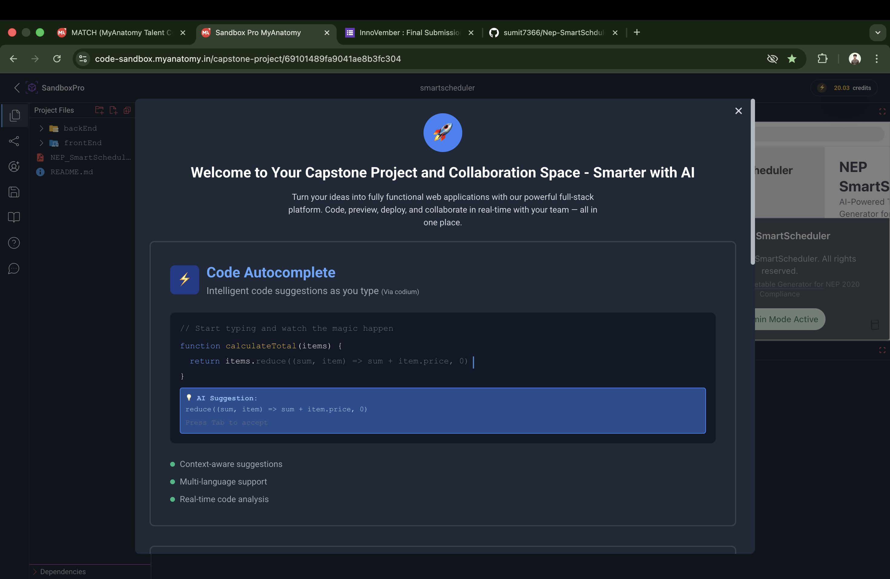
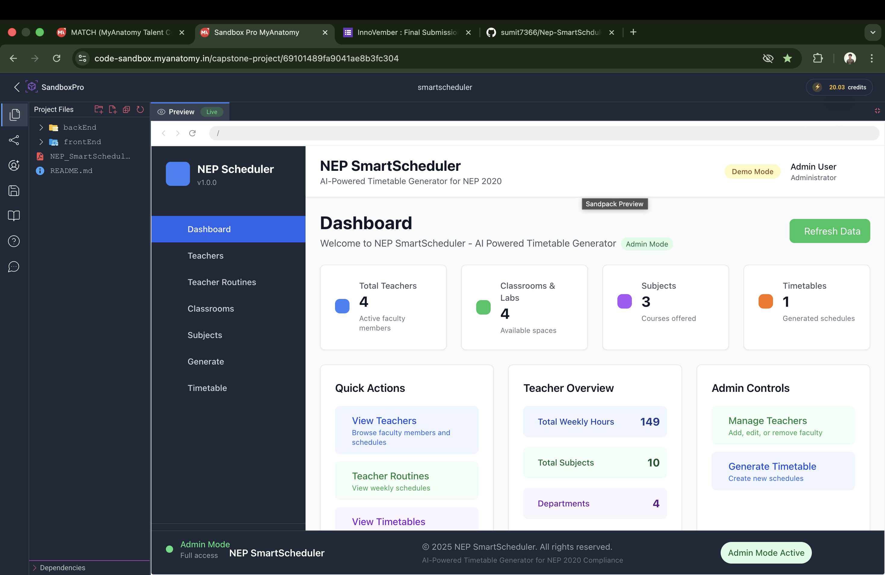

# NEP SmartScheduler: Technical Architecture and Integration Report

## 1. Executive Summary

The NEP SmartScheduler is designed as a powerful scheduling solution built on a highly decoupled MERN (MongoDB, Express, React, Node.js) architecture. Its core innovation is integrating a scheduling algorithm and an AI Assistant to manage complex constraints mandated by India's National Education Policy (NEP) 2020.

The current stage is characterized by a fully scaffolded system with operational Demo Mode APIs (index.js) and a complete Frontend Shell (App.js). This setup is crucial for continuous development and testing, ensuring that frontend components can be built and stabilized against predefined mock data before the full MongoDB and Solver integration.

| Architecture Layer | Core File/Component | Primary Function | Integration Status |
|-------------------|---------------------|------------------|-------------------|
| Frontend Shell | frontEnd/App.js | Routing, Layout, Global Admin State, DB Mode Switching | Stable (Ready for component integration) |
| Backend Core | backEnd/index.js | Server initialization, Middleware, Demo API Endpoints, Admin Control | Stable (Mock API responses configured) |
| Data Mock | Integrated into both App.js and index.js | Provides static data for teachers, subjects, and classrooms for DEMO Mode | Complete |

## Project Screenshots

### Screenshot 1

### Screenshot 2

## 2. Frontend Core: The Application Shell (frontEnd/App.js)

### 2.1. Routing, Layout, and Dependencies

- **React Router**: Uses react-router-dom for seamless navigation
- **Layout Components**: Integrates <Sidebar>, <Header>, and <Footer>
- **Global Styling**: Uses Tailwind CSS
- **Notification System**: Implements react-hot-toast

### 2.2. State and Authentication Management

- **Global State Variables**:
  - isAdmin (Boolean)
  - showAdminLogin (Boolean)
- **Authentication Logic**:
  - localStorage token management
  - Login/Logout handlers

### 2.3. The Frontend demoData

- Complete mock database for frontend
- Enables immediate component rendering
- Passed via props to all view components

## 3. Frontend Feature Highlight: The Database Mode Switcher

### 3.1. Mode Switching Mechanism

**Operational States**:
- DEMO Mode
- MONGO Mode

| Action | API Endpoint | Expected Backend Action |
|--------|-------------|------------------------|
| Status Check | /api/admin/database/status | Returns current state |
| Switch to DEMO | /api/admin/database/demo-mode | Sets server to mock data |
| Switch to MONGO | /api/admin/database/mongodb-mode | Initiates MongoDB connection |

### 3.2. Responsive UX and Error Handling

- Yellow Status: DEMO Mode
- Green Status: MONGO Mode (Connected)
- Red Warning: Connection Failure

## 4. Backend Core: The Express Server (backEnd/index.js)

### 4.1. Server Setup and Initialization

- **Dependencies**: express, cors, dotenv
- **Middleware Configuration**
- **Server Startup**: PORT 8080

### 4.2. The Backend demoData Structure

| Entity | Key Attributes | NEP Focus |
|--------|---------------|-----------|
| Teachers | routines, maxHoursPerWeek | Workload Balancing |
| Classrooms | capacity, type, facilities | Resource Optimization |
| Subjects | code, type, hoursPerWeek | Multi-disciplinary Focus |
| Timetables | entries (day, time, etc.) | Final Output |

## 5. Backend API Endpoints: Data Management

### 5.1. Teachers API
- GET /api/teachers
- POST /api/teachers

### 5.2. Classrooms API
- GET /api/classrooms
- POST /api/classrooms

### 5.3. Subjects API
- GET /api/subjects (with filtering)
- POST /api/subjects

## 6. Backend API Endpoints: Core Scheduling and AI

### 6.1. Timetable Generation and Retrieval
- GET /api/timetable
- POST /api/timetable/generate

### 6.2. AI Assistant Simulation
- POST /api/ai/assistant

## 7. Backend API Endpoints: Admin and Control

### 7.1. Diagnostic and Health Check
- GET /api/health

### 7.2. Database Mode Control
- GET /api/admin/database/status
- POST /api/admin/database/demo-mode
- POST /api/admin/database/mongodb-mode

### 7.3. Admin Authentication
- POST /api/admin/login

## 8. System Integration and Data Flow

### 8.1. Data Source Control Flow
1. Initial Load
2. Status Check
3. Mode Response
4. Frontend Action
5. User Action
6. Backend Simulation

### 8.2. Timetable Generation Flow
1. Input Collection
2. Trigger Generation
3. Solver Execution
4. Response Handling
5. Visualization

## 9. Architectural Design Principles

### 9.1. NEP 2020 Constraints
- Balanced Workload
- Interdisciplinary Focus
- Resource Alignment

### 9.2. Decoupling and Scalability (MERN)
- Frontend Scalability
- Backend Scalability
- Independent Deployment

### 9.3. API First Design
- Defined API Contract
- Parallel Development
- Integration Prevention

## 10. Conclusion and Next Steps

**Immediate Priorities**:
1. MongoDB Integration
2. Constraint Solver Implementation
3. AI Integration

The NEP SmartScheduler project has established a robust MERN foundation with DEMO Mode functionality, ready for real-world integration of database, solver, and AI components.

